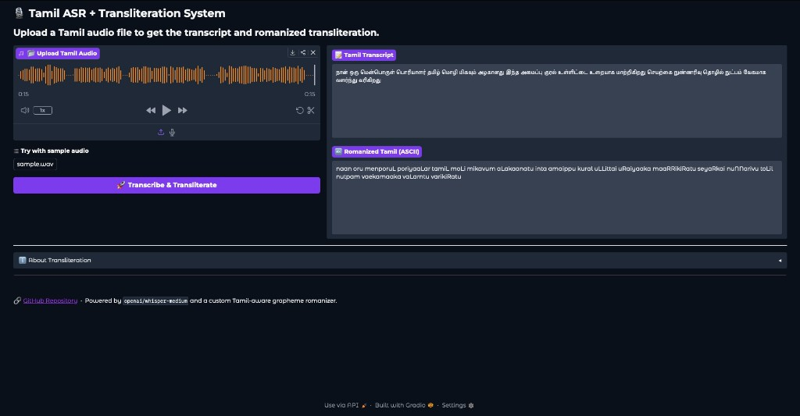

# Task 2 — ASR-Based Transcription and Transliteration System

A fully deployable Tamil ASR and transliteration system built with
Whisper, a custom Tamil-aware Latin (ASCII) romanizer, and Gradio.
Runs locally or inside Docker.



---

## System Architecture

```
Audio Input
     ↓
Audio Splitter (≤30 s chunks via pydub)
     ↓
Buffer Queue (queue.Queue, maxsize=10)
     ↓
ASR Module (openai/whisper-medium) — one call per chunk
     ↓
Per-chunk transcripts → concatenated
     ↓
Transcript (Tamil script)
     ↓
Transliteration Engine (custom Tamil → ASCII)
     ↓
User Interface (Gradio — port 7860)
```

---

## Project Structure

```
task2_asr_transliteration/
├── README.md
├── requirements.txt
├── Dockerfile
├── docker-compose.yml
├── app/
│   ├── main.py              — entry point
│   ├── asr_pipeline.py      — Whisper ASR
│   ├── transliteration.py   — pipeline wrapper
│   ├── tamil_romanizer.py   — custom Tamil → ASCII grapheme mapper
│   ├── buffer_manager.py    — queue-based buffer
│   ├── interface.py         — Gradio UI
│   └── utils.py             — helpers, file saving
├── models/
│   └── model_config.py      — central config
├── sample_inputs/
│   └── sample.wav           — Tamil sample audio
├── screenshots/
│   └── gradio_ui.png        — UI screenshot
├── outputs/
│   ├── transcripts/         — saved transcripts
│   └── transliterations/    — saved transliterations
└── tests/
    └── test_pipeline.py     — unit tests
```

---

## Stack

| Component | Tool |
|---|---|
| ASR Model | `openai/whisper-medium` |
| Transliteration | Custom Tamil-aware Latin (ASCII) Romanization (`app/tamil_romanizer.py`) |
| Interface | Gradio 4.44.0 |
| Containerization | Docker + docker-compose |
| Audio Processing | ffmpeg |

---

## Installation (Local)

Run from the `task2_asr_transliteration/` directory:

```bash
# 1. Clone the repo
git clone <repo>
cd task2_asr_transliteration

# 2. Create virtual environment
python -m venv .venv

# 3. Activate — Mac/Linux
source .venv/bin/activate

# Activate — Windows
.venv\Scripts\activate

# 4. Install dependencies
pip install -r requirements.txt
```

---

## Local Run

```bash
python app/main.py
```

Then open your browser at:
```
http://localhost:7860
```

---

## Docker Build

```bash
docker build -t asr-system .
```

---

## Docker Run

```bash
docker run -p 7860:7860 asr-system
```

Then open your browser at:
```
http://localhost:7860
```

---

## Docker Compose

```bash
docker-compose up --build
```

To stop:
```bash
docker-compose down
```

---

## Running Tests

From the `task2_asr_transliteration/` directory:

```bash
python -m pytest tests/test_pipeline.py -v
```

Or run directly:
```bash
python tests/test_pipeline.py
```

---

## How It Works

1. **Upload audio** — upload a Tamil `.wav` file or record via microphone.
2. **Audio splitting** — the input is split into fixed-duration chunks
   (≤30 s by default; configurable via `BUFFER_CONFIG.chunk_duration`).
   Files shorter than the chunk duration pass through unchanged, so the
   short-audio path stays zero-cost.
3. **Buffer queue (bounded batches)** — chunks are enqueued into a
   thread-safe `queue.Queue()` (`BufferManager`, capacity 10) and
   processed in bounded batches: the buffer fills up to 10 chunks,
   those are drained through Whisper, and the next batch is loaded.
   Peak queue size stays bounded while every chunk is transcribed
   regardless of total audio length (e.g. 25 chunks → 3 batches).
4. **ASR** — Whisper-medium transcribes each chunk to Tamil script. The
   per-chunk transcripts are concatenated to form the full transcript.
   Temporary chunk files are cleaned up in a `finally` block.
5. **Transliteration** — a custom Tamil-aware grapheme romanizer
   (`app/tamil_romanizer.py`) converts Tamil script to clean ASCII Latin
   text (long vowels doubled, retroflex consonants capitalized).
6. **Output** — both transcript and transliteration are displayed in
   the Gradio interface and saved to `outputs/`.

---

## Example Output

| Input | Output |
|---|---|
| Tamil audio | நான் ஒரு மென்பொருள் பொறியாளர் |
| Transliteration | naan oru menporuL poRiyaaLar |

---

## Notes

- Whisper-medium requires ~1.5GB disk space for model weights
- First run downloads the model automatically from HuggingFace
- `fp16=False` is set for CPU compatibility — change to `fp16=True`
  if running on GPU for faster inference
- ffmpeg must be installed on the host system for local runs
  (included automatically in Docker)
